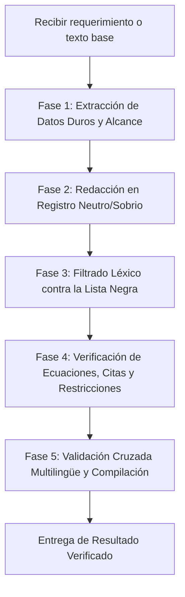

# Scientific Writing & Academic Rigor Skill

Esta skill define el estándar metodológico y lingüístico para la producción y revisión de documentos científicos, propuestas de investigación (*grant proposals* como BAYLAT, DFG, Horizon Europe, MinCiencias), reportes técnicos y artículos científicos.

Su objetivo primordial es erradicar el estilo inflado, melodramático y superficial característico de los modelos de lenguaje (*agent-speak* / *LLM fluff*), sustituyéndolo por un registro académico riguroso, formal y sobrio, propio de investigadores principales (*PIs*) y revisores de comités científicos internacionales.

---

## 1. Filosofía Fundamental: El Principio de Sobriedad Científica

1. **La ciencia se demuestra con datos y protocolos, no con adjetivos:** En un documento técnico, los adjetivos superlativos y valorativos (*"extraordinario"*, *"revolucionario"*, *"disruptivo"*, *"crucial"*, *"aberrante"*) restan credibilidad a la propuesta y activan el escepticismo inmediato de los evaluadores.
2. **Neutralidad descriptiva frente a dramatismo:** Los problemas de investigación no son *"catástrofes inminentes"* ni *"obstáculos insalvables"*; son **restricciones cinéticas, analíticas, fisicoquímicas u operativas** que se abordan mediante metodologías sistemáticas.
3. **Precisión ontológica y matemática:** Cada concepto debe corresponder exactamente a su definición en la literatura científica consolidada (física, química, termodinámica, ciencias de la computación). Queda terminantemente prohibido el uso de metáforas poéticas o simplificaciones vulgares (*"colapso de la matriz"*, *"caja negra inexplicable"*).
4. **Realismo en los compromisos:** Un documento científico nunca debe prometer entregables, arquitecturas de hardware o condiciones experimentales que no estén formalmente contemplados en el presupuesto, el cronograma o los paquetes de trabajo (*Work Packages*).

---

## 2. Los Seis Pilares de la Redacción Científica

### Pilar I: Eliminación de Grandilocuencia e Hipérbole
- **Diagnóstico:** Los LLMs tienden a exagerar la importancia de los problemas con adjetivación inflamada para generar interés artificial.
- **Regla:** Describa el fenómeno en términos de magnitudes, tasas cinéticas, límites de detección o condiciones ambientales reales.
- **Ejemplos:**
  - ❌ *Incorrecto:* "El grano experimenta una extrema vulnerabilidad intrínseca y se degrada irreversiblemente ante la severidad del clima."
  - ✅ *Correcto:* "El grano de café verde es susceptible a procesos de deterioro hidrolítico y oxidativo durante el almacenamiento prolongado en ambientes tropicales cálidos y húmedos."
  - ❌ *Incorrecto:* "La catación convencional es inherentemente subjetiva y la cromatografía tiene un costo prohibitivo y demora inaceptable."
  - ✅ *Correcto:* "El análisis sensorial estándar evalúa la calidad en el momento del ensayo sin cuantificar tasas de cambio bioquímico, mientras que la cromatografía instrumental (HPLC/GC-MS) implica tiempos de procesamiento prolongados y preparación destructiva de muestras."

### Pilar II: Lista Negra de Clichés de Agente (*LLM Agent-Speak*)
- **Diagnóstico:** Existen muletillas y frases cliché que delatan de inmediato la redacción automatizada y le restan seriedad al texto.
- **Términos estrictamente prohibidos y sus reemplazos canónicos:**

| Término Prohibido | Motivo de Rechazo | Reemplazo Académico Aprobado |
| :--- | :--- | :--- |
| **"Cuello de botella"** / *"Bottleneck"* | Cliché corporativo e informal | *Limitación metodológica*, *restricción analítica*, *desafío experimental* |
| **"Disruptivo"** / *"Disruptive"* | Jerga de mercadotecnia / *buzzword* | *Alternativa no destructiva*, *enfoque complementario*, *metodología innovadora* |
| **"Paradigma"** / *"Potente paradigma"* | Abuso retórico grandilocuente | *Marco metodológico*, *enfoque analítico*, *arquitectura predictiva* |
| **"De vanguardia"** / *"Cutting-edge"* | Cliché publicitario vacío | *Avanzado*, *reciente*, *de alta resolución*, *especializado* |
| **"Caja negra"** / *"Black box"* | Informalidad de divulgación | *Modelo puramente empírico*, *falta de restricciones físicas explícitas*, *modelo sin guía termodinámica* |
| **"Espurio"** / *"Correlación espuria"* | Muletilla computacional repetitiva | *Correlación no causal*, *sobreajuste al ruido de fondo*, *fluctuaciones aleatorias* |
| **"Colapso"** / *"Colpaso de la matriz"* | Metáfora melodramática e imprecisa | *Transición vítreo-gomosa de la matriz (*glass-to-rubber transition*)* |
| **"Innegociable"** | Tono autoritario no académico | *Condición operativa necesaria*, *criterio de diseño indispensable* |
| **"Ostenta"** / *"Liderazgo indiscutible"* | Tono chauvinista o protocolario | *Representa uno de los principales productores*, *cuenta con una producción relevante* |
| **"Desentrañar los mecanismos"** | Metáfora poética de LLM | *Identificar y cuantificar productos intermedios*, *caracterizar las rutas cinéticas* |
| **"Meticulosamente"** / *"Fielmente"* | Adverbios afectivos innecesarios | *Sistemáticamente*, *según el protocolo estándar*, *con precisión* |
| **"Aberrante"** / *"Categóricamente"* | Tono hiperbólico y dogmático | *No representativo*, *se desestima debido a*, *no se considera en este alcance* |

### Pilar III: Rigor Conceptual y Fundamento Físico-Químico
- **Regla:** Al describir fenómenos de transporte, sorción o cinéticas de degradación:
  1. Utilizar conceptos termodinámicos rigurosos: **actividad de agua ($a_w$)**, **isotermas de sorción de humedad**, **ecuación de Arrhenius**, **transición vítreo-gomosa ($T_g$)**, **cinéticas de orden cero, primero o pseudo-primer orden**.
  2. No inventar dinámicas higroscópicas *"mágicas"* ni atribuir propiedades termodinámicas a variables descriptivas no cuantificadas.
  3. En modelado espectroscópico: especificar regiones espectrales en unidades exactas ($\text{cm}^{-1}$ o $\text{nm}$), asignar bandas moleculares a vibraciones específicas (estiramiento $\text{C=O}$, flexión $\text{O-H}$, etc.) y vincular la respuesta con la ley de Beer-Lambert modificada.

### Pilar IV: Dialéctica Objetiva y Ausencia de Polémicas Defensivas
- **Diagnóstico:** Los agentes a menudo redactan secciones agresivas intentando justificar por qué su método es superior y denigrando otros métodos.
- **Regla:** Un proyecto científico no polemiza ni ataca. Explica con serenidad la idoneidad del diseño experimental para la pregunta de investigación formulada.
- **Ejemplo:**
  - ❌ *Incorrecto:* "Las cámaras climáticas isotérmicas se descartan categóricamente por generar artefactos aberrantes y falsear la cinética real mediante un calentamiento artificial intolerable."
  - ✅ *Correcto:* "Con el fin de evaluar el comportamiento del grano bajo la variabilidad térmica y de humedad característica de la cadena de suministro tropical, el diseño experimental contempla un almacenamiento longitudinal en condiciones ambientales monitoreadas (26–36 °C y 70–90 % HR), evitando condiciones isotérmicas artificiales que no reflejen las oscilaciones diarias del entorno real."

### Pilar V: Realismo Operativo y Prohibición de Alucinación de Alcance
- **Regla de Alcance:** Un texto científico o propuesta técnica debe restringirse de forma inflexible a lo presupuestado y planificado:
  1. **Hardware:** No prometer despliegues en dispositivos embebidos de bajo costo (*Raspberry Pi, microcontroladores edge, IoT en campo*) a menos que el proyecto cuente con presupuesto específico para desarrollo de hardware y pruebas de electrónica embebida.
  2. **Objetivos:** No agregar objetivos específicos no alineados con la estructura de Paquetes de Trabajo (*Work Packages - WPs*). Si hay 3 WPs, existen exactamente 3 objetivos específicos.
  3. **Condiciones de ensayo:** No mezclar ensayos isotérmicos acelerados (25, 40, 60 °C) con almacenamiento ambiental real a menos que se hayan presupuestado y descrito ambas infraestructuras.
  4. **Costos y Movilidades:** La duración de viajes, dietas diarias (*Tagegelder*), noches de hotel (*Übernachtungskosten*) y transportes deben coincidir al céntimo con las hojas de cálculo presupuestales oficiales (ej. 7.350 €, 14 días / 14 noches).

### Pilar VI: Simetría Multilingüe y Cumplimiento de Restricciones Formales
- En convocatorias internacionales (como BAYLAT / DFG / DAAD), el documento debe guardar perfecta consonancia técnica entre sus versiones en español, alemán e inglés:
  - Mismo número de objetivos específicos, mismos plazos cronológicos, mismos indicadores de desempeño ($R^2$, RMSEP, RPD).
  - Cumplimiento inflexible de límites de caracteres (ej. sistema OASys de BAYLAT) bajo cualquier normalización Unicode (NFC, NFD) y terminaciones de línea (LF, CRLF).
  - Citas bibliográficas exactas vinculadas a identificadores canónicos en `references.bib` (sin alucinar autores ni sufijos inexistentes).

---

## 3. Protocolo de Ejecución para Agentes

Al redactar, editar o traducir cualquier sección científica, el agente debe seguir obligatoriamente este procedimiento:



### Fase 1: Extracción de Hechos Técnicos
- Identificar parámetros cuantitativos exactos: rangos de temperatura, humedad relativa, tiempos de almacenamiento, normas analíticas (AOAC, ISO), bandas espectrales ($\text{cm}^{-1}$) y modelos de IA (PLSR, SVR, 1D-CNN, PINN).

### Fase 2: Redacción Neutral
- Redactar en tercera persona del singular o pasiva refleja (*"se evaluó"*, *"se modela"*, *"permite cuantificar"*).
- Estructurar oraciones claras, directas, con subordinación precisa pero sin barroquismo retórico.

### Fase 3: Filtrado Léxico
- Pasar el texto por el diccionario de términos prohibidos (ver [references/lexicon_blacklist_trilingual.md](./references/lexicon_blacklist_trilingual.md)).
- Reemplazar automáticamente cualquier modismo detectado.

### Fase 4: Control de Calidad
- Ejecutar el script linter:
  ```bash
  python3 scripts/audit_scientific_style.py <archivo.typ / archivo.md>
  ```
- Si hay caracteres o límites formales, validar con el script de cálculo exacto.

---

## 4. Rúbrica de Autoevaluación Previa a la Entrega

Antes de dar por concluida una respuesta o edición, responda afirmativamente a cada uno de estos puntos:

- [ ] ¿El texto carece de palabras de marketing (*disruptivo, vanguardia, revolucionario, sin precedentes*)?
- [ ] ¿Se eliminaron frases hechas de LLM (*cuello de botella, paradigma, simple caja negra, correlación espuria*)?
- [ ] ¿Los fenómenos físico-químicos están descritos con terminología estándar (ej. transición vítreo-gomosa, actividad de agua, leyes de conservación)?
- [ ] ¿No se añadieron promesas de hardware no financiado (ej. Raspberry Pi) ni objetivos inventados?
- [ ] ¿El tono es sereno y evita la descalificación polémica de metodologías alternativas?
- [ ] ¿Las cifras, plazos y presupuestos coinciden con la fuente de verdad del proyecto?
- [ ] ¿Las citas bibliográficas corresponden exactamente a claves existentes en `references.bib`?
- [ ] ¿La compilación (Typst / LaTeX) se ejecuta sin errores fatales?
