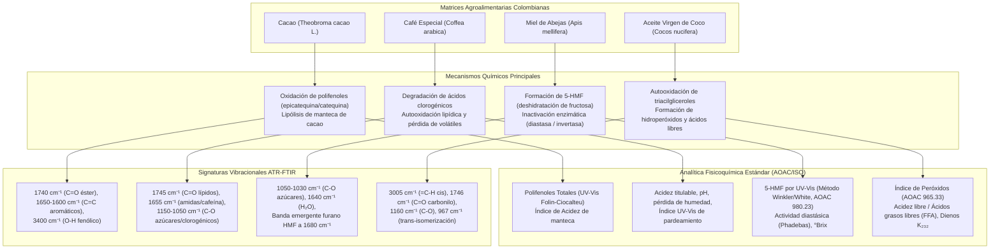
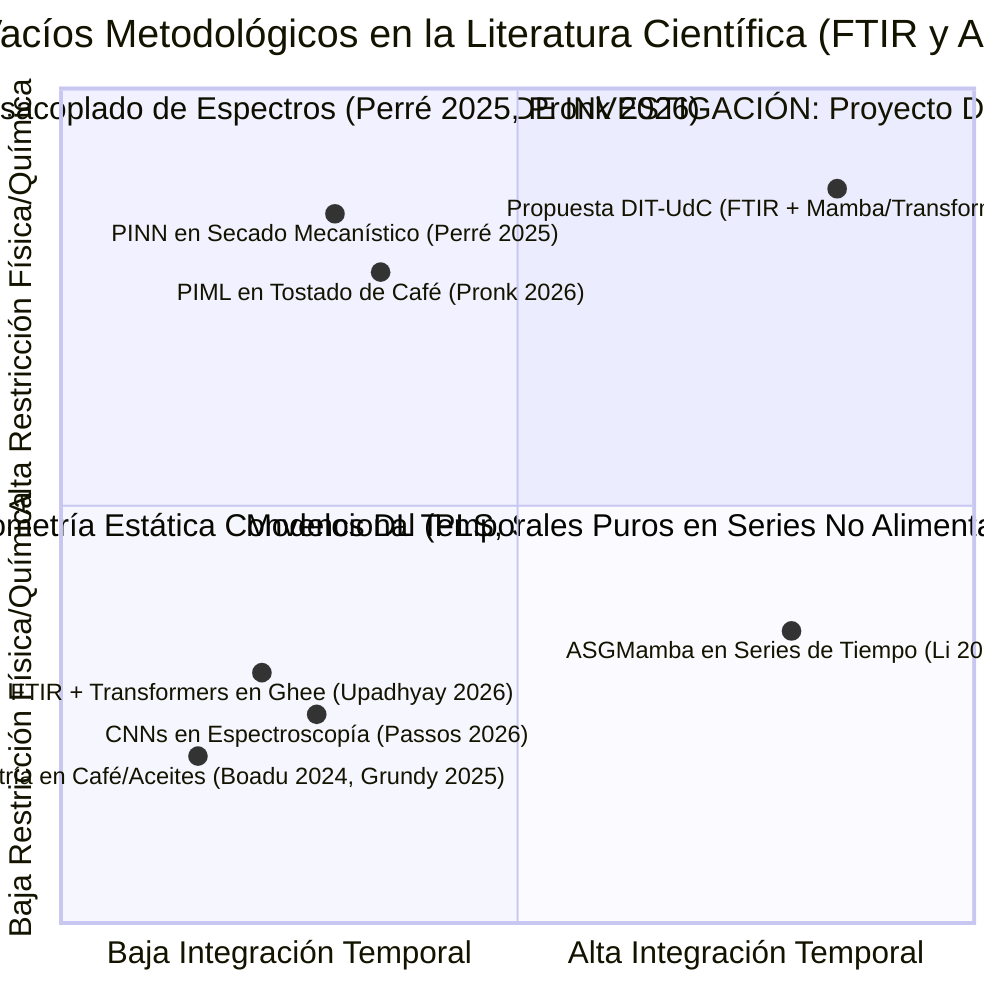
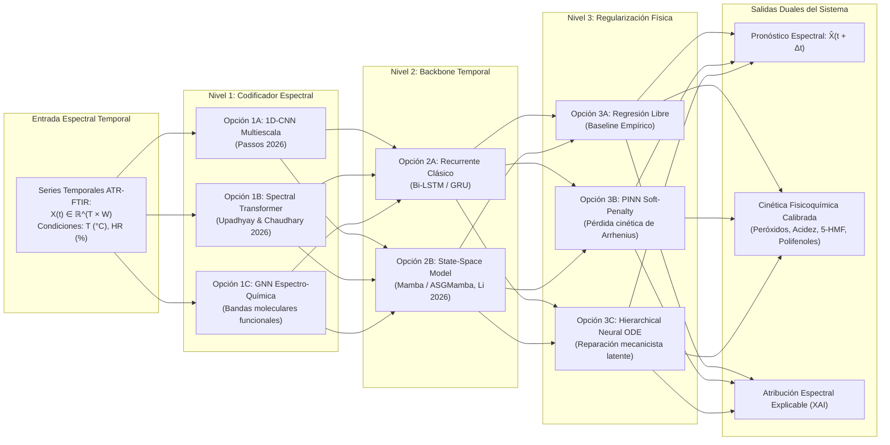
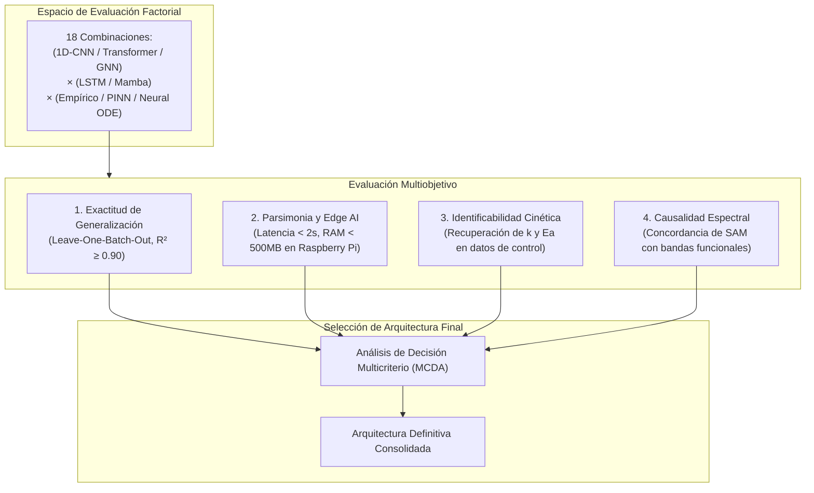
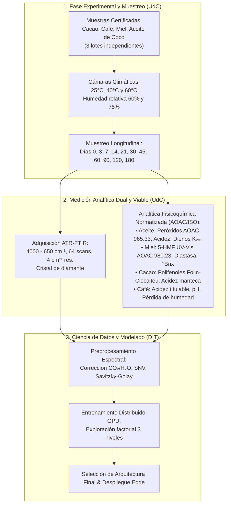

# PROPUESTA CIENTÍFICA BILATERAL BAYLAT — OASYS

**Programa de Financiación:** Förderprogramm zur Anschubfinanzierung für neue Forschungsprojekte zwischen Bayern und Lateinamerika (BAYLAT)  
**Sistema de Postulación:** OASys (Online-Antragsverwaltungssystem)  
**Institución Solicitante (Baviera / Projektpartner 1):** Deggendorf Institute of Technology (Technische Hochschule Deggendorf – DIT), Fakultät für Angewandte Informatik / Applied AI, Alemania  
**Institución Cooperadora (Colombia / Projektpartner 2):** Universidad de Cartagena (UdC), Programa de Química, Facultad de Ciencias Exactas y Naturales, Colombia  
**Duración del Proyecto:** 12 meses  
**Título del Proyecto (DE):** *Hybride Deep-Learning- und Physik-informierte FTIR-Spektroskopie zur Modellierung der Abbaukinetik kolumbianischer Agrarlebensmittel*  
**Título del Proyecto (ES):** *Espectroscopía FTIR y Aprendizaje Profundo Híbrido Informado por Física para el Modelado de la Cinética de Degradación en Matrices Agroalimentarias Colombianas*  
**Título del Proyecto (EN):** *Physics-Informed Deep Learning and FTIR Spectroscopy for Degradation Kinetics Modeling in High-Value Colombian Agri-Food Matrices*  

---

## ESTRUCTURA DEL DOCUMENTO

Este documento consta de dos partes complementarias:
1. **PARTE 1: Formulario Estructurado OASys (Campos Oficiales de la Plataforma)**  
   Textos exactos y metadatos parametrizados según los requisitos del manual de OASys (*03_Leitfaden_Antrag_mit_OASys.pdf*), listos para su transcripción directa en el sistema telemático en Alemán y Español, respetando estrictamente los límites de caracteres (`Kurzfassung` $\le$ 2.000 caracteres, `Ausführliche Projektbeschreibung` $\le$ 10.000 caracteres).
2. **PARTE 2: Exposé Científico Exhaustivo (Master Proposal / Anexo PDF de 5 MB)**  
   Memoria técnica y científica completa que sintetiza los antecedentes de *topic_proposal.pdf*, detalla la fisicoquímica de las cuatro matrices colombianas (cacao, café, miel, aceite de coco), formaliza el espacio factorial de exploración arquitectónica (1D-CNN vs. Transformer vs. GNN; LSTM/GRU vs. Mamba; PINN vs. Neural ODE), adopta un protocolo analítico ágil y viable (ATR-FTIR longitudinal + ensayos fisicoquímicos normatizados AOAC/ISO), y establece la ruta de escalamiento hacia metabolómica cromatográfica avanzada en el proyecto bilateral mayor (DFG–Minciencias).

---

# PARTE 1: FORMULARIO OFICIAL OASYS (BAYLAT)

## 1. Datos Generales y Metadatos del Proyecto (Allgemeine Projektdaten)

- **Projekttitel (DE):** Hybride Deep-Learning- und Physik-informierte FTIR-Spektroskopie zur Modellierung der Abbaukinetik kolumbianischer Agrarlebensmittel
- **Projekttitel (ES):** Espectroscopía FTIR y Aprendizaje Profundo Híbrido Informado por Física para el Modelado de la Cinética de Degradación en Matrices Agroalimentarias Colombianas
- **Projekttitel (EN):** Physics-Informed Deep Learning and FTIR Spectroscopy for Degradation Kinetics Modeling in High-Value Colombian Agri-Food Matrices
- **Stichwörter (DE):** FTIR-Spektroskopie, Abbaukinetik, Physik-informiertes Deep Learning, PINN, Neural ODE, Mamba SSM, Lebensmittelchemie, Kakao, Kaffee, Honig, Kokosöl, Kolumbien.
- **Stichwörter (ES):** Espectroscopía FTIR, Cinética de degradación, Deep Learning informado por la física, PINN, Neural ODE, Mamba SSM, Química de alimentos, Cacao, Café, Miel, Aceite de coco, Colombia.
- **Stichwörter (EN):** FTIR spectroscopy, Degradation kinetics, Physics-informed deep learning, PINN, Neural ODE, Mamba SSM, Food chemistry, Cocoa, Coffee, Honey, Coconut oil, Colombia.
- **ERC-Kategorisierung (European Research Council):**
  - *Primaria:* `PE6 Computer Science and Informatics` (PE6_11 Machine learning, statistical data processing and applications using signal processing, speech, image, video, text and data analysis; PE6_12 Scientific computing, simulation and modelling tools).
  - *Secundarias:* `PE4 Physical and Analytical Chemical Sciences` (PE4_1 Physical chemistry, PE4_5 Analytical chemistry, chemical instrumentation, separation techniques, spectroscopic and microscopic techniques); `LS9 Applied Life Sciences and Non-Medical Biotechnology` (LS9_9 Food sciences: food chemistry, food safety, post-harvest technology).
- **Art der Kooperation:** Neue strategische Kooperation / Erstkontakt mit institutionalisierter Kooperationsabsicht (Aufbau einer zukunftsweisenden bilateralen Forschungspartnerschaft).
- **Laufzeit:** 12 Monate.

---

## 2. Projektpartner (Datos de los Socios)

### Projektpartner 1: Antragsteller (Baviera, Alemania)
- **Hochschule / Institution:** Technische Hochschule Deggendorf (Deggendorf Institute of Technology – DIT)
- **Fakultät / Institut:** Fakultät für Angewandte Informatik / KI-Campus
- **Projektverantwortlicher (PI):** `[Nombre del Investigador Principal - DIT]`
- **Akademischer Grad:** Prof. Dr. / Dr.
- **Funktion:** Professor für Angewandte Künstliche Intelligenz / Data Science
- **Adresse:** Dieter-Görlitz-Platz 1, 94469 Deggendorf, Bayern, Deutschland
- **E-Mail / Tel:** `[correo.pi@th-deg.de]` / +49 (0) 991 3615-`[xxx]`
- **Kurzprofil des Antragstellers (DIT):**
  `[Nombre del Investigador Principal - DIT]` leitet die Forschungsgruppe für Maschinelles Lernen und Angewandte Künstliche Intelligenz am DIT. Seine/Ihre Expertise umfasst moderne neuronale Architekturen, Deep-Learning-Methoden für multivariate Zeitreihen, spektrale Datenanalyse sowie Physik-informierte neuronale Netze (PINNs). Das Institut verfügt über modernste GPU-Computing-Cluster für rechenintensive Modellierungen, Modellkomprimierung und Edge-AI-Implementierungen (Embedded Systems).

### Projektpartner 2: Kooperationspartner (Cartagena, Colombia)
- **Hochschule / Institution:** Universidad de Cartagena (UdC)
- **Fakultät / Institut:** Facultad de Ciencias Exactas y Naturales / Programa de Química
- **Projektverantwortlicher (PI):** `[Nombre del Investigador Principal - UdC]`
- **Akademischer Grad:** Dr. / Ph.D. en Ciencias Químicas
- **Funktion:** Profesor Titular / Investigador en Química Analítica y de Alimentos
- **Adresse:** Campus San Agustín / Sede Claustro de San Agustín, Cra. 6 #36-100, Cartagena de Indias, Bolívar, Kolumbien
- **E-Mail / Tel:** `[correo.pi@unicartagena.edu.co]` / +57 (605) `[xxxxxxx]`
- **Angaben zur Hochschule (UdC):**
  Die Universidad de Cartagena (gegründet 1827) ist die führende staatliche Hochschule im kolumbianischen Karibikraum mit institutioneller Exzellenzakkreditierung. Der Fachbereich Chemie verfügt über modern ausgestattete Labore für instrumentelle Spektroskopie (ATR-FTIR, UV-Vis) und physikochemische Lebensmittelanalytik sowie langjährige Erfahrung in der Erforschung tropischer Naturstoffe und Agrarmatrizen.
- **Kurzprofil des Kooperationspartners (UdC):**
  `[Nombre del Investigador Principal - UdC]` ist Experte für chemische Analytik, Stabilitätsstudien und Qualitätsbewertung agroalimentärer Rohstoffe. Sein/Ihr Forschungsschwerpunkt liegt auf der Kinetik des physikochemischen Abbaus, Lipid- und Polyphenoloxidation sowie standardisierten spektroskopischen und nasschemischen Messverfahren bei Kakao, Kaffee, Honig und pflanzlichen Ölen.

---

## 3. Mehrwert des Projektpartners (Valor Agregado de la Cooperación)

### En Alemán (para OASys):
> Die Kooperation zwischen der Technischen Hochschule Deggendorf (DIT) und der Universidad de Cartagena (UdC) erzeugt eine ideale interdisziplinäre Symbiose, die keine der beiden Institutionen isoliert erreichen könnte. Die UdC bringt eine exzellente experimentelle Infrastruktur in der Lebensmittel- und Naturstoffchemie ein, verfügt über direkten Zugang zu zertifizierten landwirtschaftlichen Rohstoffen Kolumbiens (Kakao, Kaffee, Honig, Kokosöl) und leitet die akzelerierten Alterungsstudien, die kontinuierliche ATR-FTIR-Spektroskopie sowie standardisierte physikochemische Referenzanalysen (AOAC/ISO). Das DIT steuert Spitzenforschung im Bereich der Angewandten Künstlichen Intelligenz bei: Formulierung von Physics-Informed Neural Networks (PINNs), State-Space-Modellen (Mamba), spektralen Transformern, Explainable AI (XAI) und Hochleistungs-GPU-Ressourcen.
> Der Mehrwert besteht in der direkten Kopplung fundierter chemisch-kinetischer Phänomene mit modernster algorithmischer Modellierung in einem hochgradig machbaren, ressourceneffizienten Rahmen. Diese transatlantische Brücke verbindet bayerische KI-Spitzentechnologie mit dem bioökonomischen Potenzial Kolumbiens, bildet Nachwuchskräfte interdisziplinär aus und legt das solide Fundament für gemeinsame Folge-Großprojekte (z. B. DFG-Minciencias).

### En Español:
> La cooperación entre el Deggendorf Institute of Technology (DIT) y la Universidad de Cartagena (UdC) genera una sinergia interdisciplinaria indispensable que ninguna de las partes podría alcanzar de forma aislada. La UdC aporta su destacada infraestructura experimental en química analítica y de alimentos, acceso directo a materias primas agroalimentarias colombianas de origen certificado (cacao, café, miel y aceite de coco), y el liderazgo en cinéticas de degradación acelerada, adquisición espectroscópica ATR-FTIR y parámetros fisicoquímicos normatizados (AOAC/ISO). Por su parte, el DIT aporta liderazgo científico en Inteligencia Artificial Aplicada: diseño de redes neuronales informadas por física (PINNs), modelos de espacio de estados (Mamba), Transformers espectrales, explicabilidad (XAI) y capacidad de cómputo en clústeres GPU de alto rendimiento.
> El valor agregado radica en transformar mediciones espectroscópicas FTIR continuas en trayectorias cinéticas reproducibles mediante arquitecturas de Deep Learning que respetan leyes físico-químicas, bajo un diseño experimental ágil y de alta viabilidad operativa. Esta alianza une la vanguardia tecnológica de Baviera con la riqueza bioeconómica de Colombia, capacita talento joven en la interfaz química-IA y cimienta las bases para postulaciones bilaterales de gran escala.

---

## 4. Bezug zur Internationalisierungsstrategie (Alineación Estratégica)

### En Alemán (para OASys):
> Das Vorhaben fügt sich nahtlos in die Internationalisierungsstrategien beider Hochschulen ein. Für die Technische Hochschule Deggendorf (DIT) unterstützt das Projekt den strategischen Ausbau des internationalen KI-Schwerpunkts sowie den Aufbau nachhaltiger Kooperationsnetzwerke mit Lateinamerika in zukunftsträchtigen Anwendungsfeldern wie Bioökonomie und smarter Lebensmittelüberwachung. Für die Universidad de Cartagena (UdC) stärkt das Vorhaben die internationale Sichtbarkeit, intensiviert den wissenschaftlichen Austausch mit bayerischen Spitzenhochschulen und fördert die Internationalisierung der Curricula in den Naturwissenschaften durch interdisziplinäre Forschungsaufenthalte. Beide Institutionen etablieren damit eine langfristige Kooperationsachse, die über Gastdozenturen, gemeinsame Publikationen und die Akquise internationaler Drittmittel nachhaltig verstetigt wird.

### En Español:
> La propuesta se alinea directamente con las directrices de internacionalización de ambas instituciones. Para el Deggendorf Institute of Technology (DIT), materializa la estrategia de proyectar sus capacidades en Inteligencia Artificial Aplicada hacia regiones emergentes clave de América Latina, consolidando alianzas bilaterales en bioeconomía y monitoreo alimentario inteligente. Para la Universidad de Cartagena (UdC), el proyecto responde a las metas de su Plan de Desarrollo Institucional relativas a la visibilidad global, la movilidad internacional de investigadores y jóvenes talentos, y la cooperación científica con centros tecnológicos de excelencia en Baviera. La colaboración formalizará un marco de cooperación duradero que facilitará intercambios, codirección de tesis y transferencia de conocimientos.

---

## 5. Kurzfassung der Projektbeschreibung (Resumen Corto, $\le$ 2.000 caracteres)

### Versión en Alemán (Texto oficial para OASys — 1.926 caracteres con espacios):
```text
Gegenstand dieses bilateralen Kooperationsprojekts zwischen der Technischen Hochschule Deggendorf (DIT, Angewandte KI) und der Universidad de Cartagena (UdC, Chemie) ist die Entwicklung eines ressourceneffizienten hybriden Ansatzes zur Modellierung und Vorhersage der zeitlichen Abbaukinetik hochrelevanter kolumbianischer Agrarlebensmittel (Kakao, Kaffee, Honig und Kokosöl) mittels FTIR-Spektroskopie und Physics-Informed Deep Learning.
Konventionelle quimiometrische Verfahren behandeln Spektren meist als statische Einzelbeobachtungen, während chromatographische Verfahren (HPLC/GC) zeit- und kostenintensiv sind. Das Projekt etabliert ein agiles, zerstörungsfreies Monitoring: Die zeitliche spektrale Evolution wird mit standardisierten physikochemischen Qualitätsindizes (AOAC/ISO: Peroxidzahl, Säuregrad, UV-Vis-Spektrophotometrie für HMF und Polyphenole) gekoppelt. Evaluiert wird ein modularer 3-Stufen-Architekturbereich: (1) spektrale Kodierung (1D-CNN vs. Spectral Transformer mit Aufmerksamkeitskarten vs. GNN über Schwingungsbanden), (2) zeitliche Modellierung (LSTM/GRU vs. Mamba/ASGMamba State-Space-Modelle) und (3) physikalische Regularisierung (PINN vs. Neural ODEs unter Arrhenius-Bedingungen).
Die finale Architektur wird kriterienbasiert anhand von Vorhersagegenauigkeit, chemischer Kausalität und Eignung für ressourcenbeschränkte Edge-Systeme (Raspberry Pi) ausgewählt. Die UdC leitet die kontrollierte akzelerierte Alterung, ATR-FTIR-Messungen und Standardanalytik. Das DIT verantwortet die mathematische Modellierung, das Modelltraining und die XAI-Validierung.
Diese BAYLAT-Anschubfinanzierung ermöglicht gegenseitige Forschungsaufenthalte, bilaterale Workshops und die Erstellung robuster Pilotdatensätze. Sie bildet das wissenschaftliche Fundament zur Beantragung eines großvolumigen DFG-Minciencias-Verbundantrags, in dem eine tiefgehende chromatographische Metabolomik-Validierung skaliert wird.
```

### Versión en Español (Texto oficial para OASys — 1.776 caracteres con espacios):
```text
Este proyecto de cooperación bilateral entre el Deggendorf Institute of Technology (DIT, IA Aplicada) y la Universidad de Cartagena (UdC, Química) desarrolla un enfoque híbrido pionero y viable para modelar y predecir la cinética de degradación temporal en matrices agroalimentarias colombianas de alto valor (cacao, café, miel y aceite de coco) mediante espectroscopía FTIR y Deep Learning informado por la física.
Superando las limitaciones de la quimiometría estática convencional y el elevado coste y tiempo de los análisis cromatográficos continuos, el proyecto adopta un diseño ágil y no destructivo: modela la evolución espectral acoplada a parámetros fisicoquímicos normatizados (AOAC/ISO: índice de peróxidos, acidez titulable, espectrofotometría UV-Vis para HMF y polifenoles). Se evalúa un espacio factorial en tres niveles: (1) codificación espectral (1D-CNN vs. Transformers espectrales SAM vs. GNN de bandas funcionales), (2) modelado temporal (LSTM/GRU vs. modelos de espacio de estados Mamba/ASGMamba) y (3) regularización física (PINN vs. Neural ODEs con leyes cinéticas y de Arrhenius).
La arquitectura final se seleccionará mediante validación experimental rigurosa que optimice precisión, interpretabilidad química y bajo consumo computacional en hardware de borde (edge AI / Raspberry Pi). La UdC lidera la degradación acelerada, adquisición ATR-FTIR y analítica fisicoquímica estándar. El DIT lidera el diseño algorítmico, modelado físico-neuronal y explicabilidad.
Esta ayuda semilla de BAYLAT financia estancias de investigación cruzadas, talleres bilaterales y la consolidación de datos piloto longitudinales, cimentando la propuesta bilateral de gran envergadura (DFG-Minciencias), donde se escalará la metabolómica cromatográfica de alta resolución.
```

---

## 6. Ausführliche Projektbeschreibung (Descripción Detallada, $\le$ 10.000 caracteres)

### Versión en Alemán (Texto oficial para OASys — 5.922 caracteres con espacios):
```text
1. Problemstellung, gesellschaftliche Relevanz und Gesamtziel
Kolumbianische Agrarrohstoffe wie Kakao (Theobroma cacao L.), Spezialitätenkaffee (Coffea arabica), Bienenhonig (Apis mellifera) und natives Kokosöl (Cocos nucifera) besitzen eine herausragende sozioökonomische Bedeutung für kleinbäuerliche Erzeuger und regionale Wertschöpfungsketten im karibischen und andinen Raum Kolumbiens. Während der Lagerung, des Transports und unter wechselnden Klimabedingungen unterliegen diese Matrizen komplexen physikalisch-chemischen Alterungsprozessen (Lipidoxidation, Polyphenolabbau, Maillard-Reaktionen, enzymatischer Qualitätsverlust). Die bisherige Haltbarkeitsüberwachung stützt sich weitgehend auf aufwendige, destruktive chemische Analysen, die für ein kontinuierliches Monitoring vor Ort ungeeignet sind.
Das Gesamtziel dieses 12-monatigen Kooperationsvorhabens zwischen der Technischen Hochschule Deggendorf (DIT) und der Universidad de Cartagena (UdC) ist die Entwicklung eines ressourcenschonenden, schnellen und zerstörungsfreien Paradigmas: die kontinuierliche Vorhersage der zeitlichen Abbaukinetik durch die Kopplung von Fourier-Transform-Infrarotspektroskopie (ATR-FTIR) mit fortgeschrittenem, physikalisch-informiertem Deep Learning (PIML), validiert durch etablierte nasschemische und spektrophotometrische Standardparameter.

2. Wissenschaftlicher Stand und Forschungslücken
Die Fachliteratur (vgl. Upadhyay & Chaudhary 2026, Passos 2026, Grundy et al. 2025) belegt, dass FTIR in der Lebensmittelanalytik fast ausschließlich für statische Klassifikationsaufgaben (Authentizitäts- und Verfälschungsprüfung) mittels multivariater Statistik (PCA, PLS) eingesetzt wird. Longitudinales Monitoring zeitabhängiger Abbauvorgänge ist bisher kaum erforscht.
Reine Deep-Learning-Verfahren fungieren oft als Black-Box-Modelle, die bei korrelierten Spektraldaten zu Scheinkorrelationen neigen. Bisherige physikalisch informierte Modelle (z. B. PINNs für Trocknungsprozesse, Perré 2025) basieren meist auf reinen Simulationen ohne reale Spektraldaten. Kürzliche Studien zum Kaffeerösten (Pronk & Anthony 2026) mahnen zudem, dass physikalische Restriktionen bei unzureichender Identifizierbarkeit Verzerrungen verursachen können. Es fehlt an longitudinal harmonisierten Datensätzen und an Modellen, die spektrale Evolution, Zeitreihendynamik und chemische Plausibilität effizient vereinen.

3. Spezifische Ziele des Vorhabens
- Ziel 1: Etablierung eines standardisierten Versuchsprotokolls an der UdC zur akzelerierten Degradation von Kakao, Kaffee, Honig und Kokosöl unter kontinuierlicher ATR-FTIR-Erfassung und paralleler Bestimmung normierter physikochemischer Kennzahlen (Peroxidzahl, Säuregrad, UV-Vis-Spektrophotometrie).
- Ziel 2: Entwicklung und Benchmark eines modularen 3-Stufen-Architekturbereichs am DIT zur spektralen Zeitreihenvorhersage (Forecasting) und Kinetikregression.
- Ziel 3: Rigorose Auswahl der optimalen Modellkombination nach Pareto-Kriterien (Prädiktionsgenauigkeit, chemische Kausalität, Rechenaufwand auf Edge-Hardware wie Raspberry Pi).
- Ziel 4: Bilateraler Austausch, Ausbildung von Nachwuchskräften und Ausarbeitung eines DFG-Minciencias-Folgeantrags zur Skalierung auf chromatographische Hochdurchsatz-Metabolomik.

4. Methodischer Ansatz und modularer Architekturbereich
Das Projekt setzt auf ein modulares, pragmatisches und validiertes Vorgehen:
- Stufe 1: Spektrale Kodierung. Vergleich von 1D-CNNs mit multiskalaren Filtern (Passos 2026), Spectral Transformern mit Aufmerksamkeitskarten (SAM; Upadhyay & Chaudhary 2026) und spektral-chemischen Graph Neural Networks (GNNs) auf Basis molekularer Schwingungsbanden.
- Stufe 2: Zeitliche Sequenzmodellierung. Gegenüberstellung von rekurrierenden Netzwerken (LSTM, GRU) und modernen linearen State-Space-Modellen (Mamba / ASGMamba; Li et al. 2026) mit linearer Komplexität O(L) für kontinuierliche Zeitreihen.
- Stufe 3: Physikalische Regularisierung. Vergleich einer empirischen Basislinie mit PINNs (weiche Strafterme nach Reaktionsordnungen 0, 1, 2 und Arrhenius-Gleichung) sowie hierarchischen Neural ODEs.
Architekturauswahl: Die Entscheidung für die finale Architektur erfolgt nach einem Pareto-Optimum aus: (i) Generalisierungsfehler bei chargenweiser Kreuzvalidierung (Leave-One-Batch-Out), (ii) Identifizierbarkeit kinetischer Parameter, (iii) chemischer Plausibilität der Aufmerksamkeitsgewichte und (iv) Latenz auf Edge-Hardware (Single-Board-Computer).

5. Institutionelle Arbeitsteilung und Synergien
- Universidad de Cartagena (UdC, Chemie): Probenbereitstellung und botanische Verifizierung; Durchführung von Alterungsversuchen in Klimakammern (25 °C, 40 °C, 60 °C); ATR-FTIR-Spektrenakquise; Durchführung normierter Referenzanalysen (Peroxidzahl AOAC 965.33, Säuregrad, UV-Vis-Spektrophotometrie für 5-HMF nach AOAC 980.23, Folin-Ciocalteu für Gesamtpolyphenole, Refraktometrie).
- Technische Hochschule Deggendorf (DIT, Angewandte KI): Spektrale Vorverarbeitung (SNV, Savitzky-Golay); Modellierung und Training der neuronalen Netzwerke auf GPU-Clustern; mathematische Formulierung kinetischer Verlustfunktionen; XAI-Bandenvalidierung und Prototyping für Edge-Inferenz.

6. Arbeitsplan und Zukunftsperspektive
Das 12-monatige Projekt gliedert sich in 4 Arbeitspakete (AP):
- AP1 (Monate 1–4): Versuchsdesign, Probenbeschaffung und Spektroskopie-Standardisierung an der UdC; Initialer Workshop in Cartagena.
- AP2 (Monate 3–8): Durchführung der Alterungsversuche, longitudinale ATR-FTIR-Scans und physikochemische Standardanalytik an der UdC; Datenaufbereitung am DIT.
- AP3 (Monate 6–11): Modelltraining, systematischer Benchmark der 3 Architekturstufen am DIT; Auswahl der Pareto-optimalen Modellarchitektur; XAI-Attributionsanalyse.
- AP4 (Monate 10–12): Bilateraler Synthese-Workshop in Deggendorf; gemeinsame Publikationen; Ausarbeitung des DFG-Minciencias-Großantrags zur Integration von HPLC-MS/GC-MS-Metabolomik.
```

### Versión en Español (Texto oficial para OASys — 6.583 caracteres con espacios):
```text
1. Planteamiento del problema, relevancia socioeconómica y objetivo general
Las matrices agroalimentarias colombianas de alto valor comercial, tales como el cacao (Theobroma cacao L.), el café especial (Coffea arabica), la miel de abejas (Apis mellifera) y el aceite virgen de coco (Cocos nucifera), constituyen motores socioeconómicos fundamentales para la agricultura familiar y las cadenas de exportación del Caribe y los Andes colombianos. Durante las etapas de poscosecha, transporte y almacenamiento bajo condiciones climáticas variables, estos productos sufren procesos progresivos de degradación fisicoquímica (oxidación lipídica, pérdida de polifenoles bioactivos, reacción de Maillard, inactivación enzimática). El monitoreo tradicional de su vida útil se basa en métodos destructivos o en análisis cromatográficos de alta complejidad instrumental (HPLC, GC-MS) que resultan inviables para un control continuo y ágil en campo o centros de acopio.
El objetivo general de este proyecto de cooperación bilateral de 12 meses entre el Deggendorf Institute of Technology (DIT, Alemania) y la Universidad de Cartagena (UdC, Colombia) es desarrollar un paradigma no destructivo, ágil y de alta viabilidad técnica: la modelación y predicción continua de la cinética de degradación temporal mediante la integración de espectroscopía infrarroja por transformada de Fourier (ATR-FTIR) y Deep Learning informado por la física (PIML), calibrado con parámetros fisicoquímicos y espectrofotométricos normatizados de bajo costo.

2. Estado actual del arte y vacíos de investigación
La literatura especializada (Upadhyay & Chaudhary 2026, Passos 2026, Grundy et al. 2025, Widiarto et al. 2026) demuestra que la espectroscopía FTIR en alimentos se ha enfocado casi con exclusividad en la clasificación estática de autenticidad o adulteración mediante quimiometría tradicional (PCA, PLS). El seguimiento temporal continuo de cinéticas de degradación representa una frontera inexplorada.
Por otra parte, los modelos de Deep Learning convencionales operan como cajas negras susceptibles a correlaciones espurias sobre el ruido espectral. Los modelos físicos existentes (PINNs para secado, Perré 2025) se limitan a simulaciones térmicas desacopladas del espectro vibracional. Además, estudios recientes en tostado de café (Pronk & Anthony 2026) advierten que incorporar restricciones físicas no garantiza por sí mismo mayor precisión si las ecuaciones no están adecuadamente condicionadas. Persiste un vacío evidente respecto a bases de datos longitudinales armonizadas y modelos que armonicen la dinámica temporal con interpretabilidad físico-química bajo presupuestos operativos realistas.

3. Objetivos específicos del proyecto
- Objetivo 1: Establecer un protocolo experimental estandarizado en la UdC para someter lotes de cacao, café, miel y aceite de coco a degradación acelerada bajo monitoreo longitudinal por ATR-FTIR y medición simultánea de parámetros fisicoquímicos normatizados (índice de peróxidos, acidez titulable, espectrofotometría UV-Vis).
- Objetivo 2: Diseñar e implementar en el DIT un espacio modular de arquitecturas de Deep Learning para el pronóstico espectral temporal y la estimación cinética de deterioro.
- Objetivo 3: Evaluar y seleccionar la arquitectura óptima mediante criterios multiobjetivo de Pareto (precisión, interpretabilidad química demostrable y bajo consumo en hardware embebido tipo Raspberry Pi).
- Objetivo 4: Fortalecer la movilidad académica bilateral, capacitar a jóvenes investigadores y elaborar la postulación conjunta a una convocatoria de gran envergadura (DFG-Minciencias) para escalar a análisis metabolómico cromatográfico profundo.

4. Enfoque metodológico y espacio modular de arquitecturas
El proyecto implementa un diseño experimental y computacional factorial en tres niveles:
- Nivel 1 (Codificación Espectral): Comparación entre 1D-CNNs con filtros multiescala adaptados al ancho de banda vibracional (Passos 2026), Transformers espectrales con mapas de atención por bandas (SAM; Upadhyay & Chaudhary 2026), y Redes de Grafos (GNN) estructuradas sobre enlaces moleculares.
- Nivel 2 (Modelado Temporal de Secuencias): Comparación entre redes recurrentes (LSTM, GRU) y Modelos de Espacio de Estados selectivos (Mamba / ASGMamba; Li et al. 2026), que ofrecen complejidad lineal O(L) para trayectorias continuas de degradación.
- Nivel 3 (Regularización Física y Cinética): Comparación entre regresión no restringida, PINNs con penalizaciones basadas en cinética química (órdenes 0, 1 y 2, ecuación de Arrhenius) y Neural ODEs jerárquicas.
Criterio de Selección Final: La arquitectura ganadora se determinará evaluando: (i) error de generalización en particiones externas por lotes (Leave-One-Batch-Out), (ii) identificabilidad de constantes cinéticas, (iii) correspondencia química de los pesos de atención con bandas funcionales reales, y (iv) latencia y consumo de memoria compatibles con dispositivos de borde.

5. División institucional del trabajo y sinergias
- Universidad de Cartagena (Química): Selección y trazabilidad de muestras agrícolas colombianas; diseño de cámaras de degradación acelerada (25 °C, 40 °C, 60 °C; 60% y 75% HR); barrido longitudinal ATR-FTIR; ejecución de ensayos analíticos normatizados de bajo costo (índice de peróxidos AOAC 965.33, acidez titulable, espectrofotometría UV-Vis para HMF según AOAC 980.23, método Folin-Ciocalteu para polifenoles totales, refractometría °Brix).
- Deggendorf Institute of Technology (Applied AI): Preprocesamiento espectral (corrección de línea base, SNV, derivadas Savitzky-Golay); programación y entrenamiento de modelos neuronales en GPU; formulación de pérdidas físicas diferenciales; evaluación de explicabilidad (XAI) y optimización para hardware de bajo costo.

6. Plan de trabajo y proyección a largo plazo
El cronograma de 12 meses se divide en 4 Paquetes de Trabajo (WP):
- WP1 (Meses 1–4): Protocolos analíticos, acondicionamiento de lotes y estandarización ATR-FTIR en UdC. Taller bilateral de apertura en Cartagena.
- WP2 (Meses 3–8): Ensayos de envejecimiento acelerado, mediciones continuas FTIR y análisis fisicoquímicos normatizados en UdC; curaduría de la base de datos en DIT.
- WP3 (Meses 6–11): Benchmarking factorial de arquitecturas en DIT; selección de la arquitectura óptima según criterios de Pareto; validación de bandas por XAI.
- WP4 (Meses 10–12): Taller de síntesis bilateral en Deggendorf; redacción de artículos científicos conjuntos; estructuración del proyecto mayor DFG-Minciencias para incorporar metabolómica fina por HPLC/GC-MS.
```

---

## 7. Expertise und Finanzierungsbegründung (Experticia y Justificación de Financiación)

### Warum ist keine andere Förderung möglich? (¿Por qué no es posible otra financiación?)
> Für die Etablierung dieser neuartigen, transatlantischen Forschungskooperation existiert in dieser initialen Phase kein alternatives Förderformat. Großvolumige Förderprogramme wie die gemeinsame bilaterale Sachbeihilfe der Deutschen Forschungsgemeinschaft (DFG) und Minciencias oder Horizon Europe setzen zwingend belastbare, experimentell verifizierte Pilotdaten, harmonisierte Spektral- und Referenzdatensätze sowie den Nachweis einer bereits funktionierenden interinstitutionellen Zusammenarbeit voraus. 
> Ohne die gezielte Anschubfinanzierung durch BAYLAT können die erforderlichen bilateralen Präsenz-Workshops zur Standardisierung der experimentellen Protokolle und zur Datenharmonisierung sowie die gegenseitigen Forschungs- und Laboraufenthalte nicht finanziert werden. Die BAYLAT-Förderung fungiert somit als unverzichtbarer Katalysator zur Risikominimierung und zur wissenschaftlichen Reifung des Vorhabens, um die Wettbewerbsfähigkeit für den avisierten Großantrag sicherzustellen.

### Bezug zu einer Ausschreibung / Zukünftiger Drittmittelantrag (Proyección Convocatoria de Gran Escala)
- **Zielprogramm 1:** DFG-Minciencias Bilateral Research Grants Call (Gemeinsame Ausschreibung der Deutschen Forschungsgemeinschaft und des kolumbianischen Wissenschaftsministeriums Minciencias zur Förderung bilateraler Verbundforschungsvorhaben).
- **Zielprogramm 2:** BMBF Internationale Zusammenarbeit in der Bioökonomie / Lateinamerika.
- **Zeithorizont der Antragseinreichung:** Monat 11–12 der Projektlaufzeit.

---

## 8. Arbeits- und Zeitplan (Plan de Trabajo y Cronograma de 12 Meses)

| Monat | Arbeitspaket (AP) | Institution | Aktivitäten und Meilensteine |
| :---: | :--- | :---: | :--- |
| **M1** | AP1: Versuchsplanung & Probenahme | UdC | Beschaffung und botanische Zertifizierung von Kakao-, Kaffee-, Honig- und Kokosöl-Chargen. Kalibrierung der Klimakammern (25 °C, 40 °C, 60 °C; 60%, 75% r.F.). |
| **M2** | AP1: Spektroskopie-Standardisierung | UdC / DIT | **Workshop 1 (Präsenz in Cartagena):** Etablierung des ATR-FTIR-Messprotokolls, Bereinigung von CO₂/H₂O-Banden, Definition der physikochemischen Standardanalysen (AOAC/ISO). |
| **M3** | AP2: Kinetische Datenerfassung | UdC | Start der akzelerierten Degradationsreihen. Periodische FTIR-Scans ($t_0, t_1, ..., t_n$) und nasschemische Standardanalytik (Peroxidzahl, Säurezahl, UV-Vis HMF). |
| **M4** | AP2: Fortlaufendes Monitoring | UdC | Fortführung der FTIR-Zeitreihen. Probenahme und Messung spektrophotometrischer Kennzahlen (Polyphenole, Diastaseaktivität). |
| **M5** | AP2: Datenkonsolidierung | UdC / DIT | Erste Datenübergabe an DIT. Standardisierung der Spektraldatenbank, Rauschunterdrückung, Savitzky-Golay-Derivation und Baseline-Korrektur (SNV/MSC). |
| **M6** | AP3: Algorithmen-Implementierung | DIT | Implementierung der Stufe-1-Modelle (1D-CNN, Spectral Transformer mit SAM, GNN) und Stufe-2-Modelle (LSTM, Mamba) auf GPU-Clustern. |
| **M7** | AP2 & AP3: Abschluss Messungen & PIML | UdC / DIT | Abschluss der experimentellen Stabilitätsstudien an der UdC. Formulierung der kinetischen Straffunktionen (PINN und Neural ODEs) am DIT. |
| **M8** | AP3: Modelltuning & Ablationsstudien | DIT | Faktorielles Training der Modellkombinationen. Evaluierung der Generalisierbarkeit via *Leave-One-Batch-Out* und *Leave-One-Matrix-Out*. |
| **M9** | AP3: Kriterienbasierte Architekturauswahl | DIT / UdC | **Meilenstein M3:** Auswahl der finalen Architektur anhand der Pareto-Kriterien (Genauigkeit, chemische Kausalität, Rechenaufwand, Edge-Kompatibilität). |
| **M10** | AP3 / AP4: XAI & Edge-Validierung | DIT / UdC | Spektrale Aufmerksamkeitsanalyse (SAM vs. funktionelle Banden). Vorbereitung des Edge-Inferenz-Prototyps (Raspberry Pi). |
| **M11** | AP4: Bilateraler Synthese-Workshop | DIT / UdC | **Workshop 2 (Präsenz in Deggendorf):** Auswertung aller Ergebnisse, Fertigstellung von 2 gemeinsamen wissenschaftlichen Publikationen. |
| **M12** | AP4: Drittmittelantrag & Projektabschluss | DIT / UdC | **Meilenstein M4:** Einreichung des gemeinsamen DFG-Minciencias-Verbundantrags (mit Skalierung auf HPLC-MS/GC-MS). Finaler Bericht an BAYLAT. |

---

## 9. Reiseverwaltung und Mobilitätsplanung (Reise- und Budgetmatrix)

Die BAYLAT-Anschubfinanzierung dient primär der Deckung von Reise- und Aufenthaltskosten für Forschende und Nachwuchswissenschaftler beider Institutionen:

1. **Reise 1 (Monat 2) — DIT nach Cartagena (Kolumbien):**
   - *Teilnehmer:* `[Nombre del Investigador Principal - DIT]` (PI) + 1 Nachwuchswissenschaftler (DIT).
   - *Dauer:* ca. 7–10 Tage.
   - *Ziel:* Teilnahme an Workshop 1 an der UdC, Inspektion der chemischen Labore, Feinabstimmung der spektralen Messparameter (ATR-FTIR) und Etablierung des gemeinsamen Datenübertragungs- und Qualitätssicherungsprotokolls.
2. **Reise 2 (Monat 11) — UdC nach Deggendorf (Deutschland):**
   - *Teilnehmer:* `[Nombre del Investigador Principal - UdC]` (PI) + 1 Nachwuchswissenschaftler (UdC).
   - *Dauer:* ca. 10–14 Tage.
   - *Ziel:* Teilnahme an Workshop 2 am DIT, Auswertung der physikochemischen Validierungsdaten, gemeinsame Evaluierung der Modellarchitektur am GPU-Cluster und Ausarbeitung des Folge-Großantrags (DFG-Minciencias).

---

## 10. Einbindung von Nachwuchswissenschaftlern (Beteiligung von Nachwuchskräften)

Das Projekt legt höchsten Wert auf die Förderung des wissenschaftlichen Nachwuchses:
- **Universidad de Cartagena:** Einbindung von mindestens 2 fortgeschrittenen Studierenden (Pregrado / Maestría en Química) zur Durchführung der Alterungsversuche, Probenextraktion, FTIR-Messungen und normierten Referenzanalysen im Rahmen ihrer Abschlussarbeiten.
- **Technische Hochschule Deggendorf:** Einbindung von mindestens 1 Master-Studierenden (M.Sc. Applied AI / Data Science) oder Doktoranden in die Modellentwicklung, das Training von Mamba/Transformer/PINN-Architekturen und die XAI-Validierung.
- **Interdisziplinärer Mehrwert:** Die Nachwuchswissenschaftler erwerben bi-disziplinäre Kompetenzen an der hochaktuellen Schnittstelle von moderner Spektroskopie, Lebensmittelchemie und Künstlicher Intelligenz.

---

## 11. Dateiverwaltung (Checklist für OASys-Uploads)

Gemäß Kapitel 9 des OASys-Leitfadens sind folgende Dokumente als PDF (maximal 5 MB je Datei) hochzuladen:
- [x] **Ausführliche Projektbeschreibung (Wissenschaftliches Exposé):** Vollständiges technisches Dokument (entspricht Teil 2 dieses Dokuments).
- [x] **Curriculum Vitae (CV) des bayerischen Projektleiters (DIT):** Akademischer Werdegang, Publikationsliste (Schwerpunkt KI/Data Science), Drittmittelerfahrung.
- [x] **Curriculum Vitae (CV) des kolumbianischen Projektleiters (UdC):** Akademischer Werdegang, Publikationsliste (Schwerpunkt Chemie/Spektroskopie), Forschungsprojekte.
- [x] **Curriculum Vitae der beteiligten Nachwuchswissenschaftler.**
- [x] **Kooperationsvereinbarung / Letter of Intent (LoI):** Unterzeichnet von den zuständigen Hochschulleitungen bzw. Dekanaten der TH Deggendorf und der Universidad de Cartagena.
- [x] **Befürwortungsschreiben der Fakultät / des International Office.**

---
---

# PARTE 2: EXPOSÉ CIENTÍFICO EXHAUSTIVO (MASTER PROPOSAL / ANEXO PDF)

## DOCUMENTO CIENTÍFICO MAESTRO: MODELADO HÍBRIDO DE LA CINÉTICA DE DEGRADACIÓN EN ALIMENTOS COLOMBIANOS MEDIANTE FTIR Y DEEP LEARNING INFORMADO POR FÍSICA

---

## I. Introducción, Justificación y Relevancia Socioeconómica

Colombia es reconocido internacionalmente por la excepcional calidad y diversidad de su producción agroalimentaria. En particular, cuatro matrices ostentan un valor estratégico crítico para la bioeconomía del país y las economías rurales de pequeña escala:
1. **Cacao (*Theobroma cacao L.*):** Clasificado mayoritariamente por la Organización Internacional del Cacao (ICCO) como "cacao fino y de aroma", representa el sustento de más de 50.000 familias en zonas de posconflicto y valles interandinos y caribeños. Su calidad poscosecha depende críticamente de la estabilidad de polifenoles bioactivos y de la fracción lipídica (manteca de cacao).
2. **Café Especial (*Coffea arabica*):** Producto insignia de exportación. Las variedades colombianas de alta gama (Castillo, Caturra, Geisha) obtienen precios premium basados en su frescura, equilibrio lipídico y acidez característica, propiedades térmicamente lábiles y altamente susceptibles a la autooxidación.
3. **Miel de Abejas (*Apis mellifera*):** Producida de manera creciente en reservas ecológicas y agroecosistemas del Caribe seco y bosques húmedos. Su comercialización formal enfrenta retos severos debido al deterioro térmico durante el almacenamiento, manifestado en el aumento de 5-hidroximetilfurfural (5-HMF) y la pérdida de actividad enzimática.
4. **Aceite Virgen de Coco (*Cocos nucifera*):** Motor económico de comunidades costeras en el litoral Pacífico y Caribe. Rico en ácidos grasos de cadena media (principalmente ácido láurico), es altamente cotizado en las industrias nutracéutica y cosmética europea, pero sufre reacciones de autooxidación y rancidez hidrolítica si se somete a condiciones ambientales adversas.

Durante el transporte marítimo hacia Europa (20 a 45 días) y el almacenamiento prolongado en bodegas con fluctuaciones térmicas ($20\,^{\circ}\mathrm{C} - 45\,^{\circ}\mathrm{C}$) y de humedad ($50\% - 85\%$), estas matrices experimentan cinéticas de deterioro complejas. 

Monitorear esta pérdida de calidad mediante análisis cromatográficos continuos (HPLC, GC-MS) resulta inviable en la práctica operativa por su elevado costo por muestra, la necesidad de reactivos tóxicos y tiempos de espera prolongados. Frente a esto, la espectroscopía infrarroja por transformada de Fourier (**ATR-FTIR**) ofrece una alternativa rápida, no destructiva y libre de reactivos. Sin embargo, extraer trayectorias cinéticas a partir de espectros continuos requiere modelos de inteligencia artificial avanzados que combinen la capacidad de representación profunda con leyes cinéticas fundamentales de la fisicoquímica, calibrados mediante ensayos fisicoquímicos normatizados y reproducibles.

---

## II. Fenomenología Fisicoquímica y Cinética de Deterioro por Matriz

Para que los modelos de Machine Learning posean validez mecanicista, se fundamentan en las transformaciones moleculares reales y en parámetros fisicoquímicos estándar de control:



### 1. Cacao: Oxidación Fenólica y Alteración Lipídica
- **Mecanismo:** La degradación de flavan-3-oles (epicatequina y catequina) genera polímeros condensados que amortiguan la absorción en $3400\,\text{cm}^{-1}$ ($\text{O-H}$) y modifican las bandas de anillos aromáticos ($1600 - 1515\,\text{cm}^{-1}$). La hidrólisis de triglicéridos incrementa la acidez libre de la manteca de cacao.
- **Validación Estándar:** Cuantificación espectrofotométrica UV-Vis de polifenoles totales mediante el reactivo de Folin-Ciocalteu y determinación volumétrica del índice de acidez en la manteca.

### 2. Café: Pérdida de Frescura y Oxidación Lipídica
- **Mecanismo:** Durante el almacenamiento, los ácidos clorogénicos experimentan hidrólisis térmica ($1150 - 1380\,\text{cm}^{-1}$), mientras que los lípidos superficiales sufren autooxidación, alterando el cociente entre $1745\,\text{cm}^{-1}$ ($\text{C=O}$) y $2850 - 2920\,\text{cm}^{-1}$ ($\text{C-H}$ alifático).
- **Validación Estándar:** Pérdida gravimétrica de humedad, medición de pH, acidez titulable y absorbancia UV-Vis indicadora de reacciones de Maillard.

### 3. Miel de Abejas: Formación de 5-HMF e Inactivación Enzimática
- **Mecanismo:** En condiciones de temperatura elevada, la fructosa se deshidrata formando 5-hidroximetilfurfural (5-HMF). En FTIR, esto induce alteraciones en la región dactilar de azúcares ($900 - 1150\,\text{cm}^{-1}$) y la emergencia de la señal carbonílica conjugada del anillo furánico en torno a $1680\,\text{cm}^{-1}$.
- **Validación Estándar:** Determinación de 5-HMF por espectrofotometría UV-Vis directa mediante el método normalizado de Winkler / White (AOAC 980.23 / Codex Alimentarius), actividad diastásica por método fotométrico Phadebas y contenido de sólidos solubles (°Brix) por refractometría.

### 4. Aceite Virgen de Coco: Rancidez Oxidativa e Isomerización
- **Mecanismo:** La autooxidación por radicales libres genera hidroperóxidos inestables (visibles en la banda hidroperóxido a $3470\,\text{cm}^{-1}$), disminución del enlace insaturado cis a $3005\,\text{cm}^{-1}$, isomerización trans a $967\,\text{cm}^{-1}$ y ensanchamiento del carbonilo éster a $1746\,\text{cm}^{-1}$.
- **Validación Estándar:** Índice de Peróxidos mediante titulación yodométrica estandarizada (AOAC 965.33), acidez libre (% de ácido láurico por titulación ácido-base) y coeficientes de extinción específica UV ($K_{232}$ y $K_{270}$) para dienos y trienos conjugados.

---

## III. Análisis Crítico del Estado del Arte y Vacíos Metodológicos

A partir de la revisión de literatura condensada en [`topic_proposal.pdf`](file:///home/echoes/projects/AI_project/proyecto-babiera/topic_proposal.pdf) y [`references.bib`](file:///home/echoes/projects/AI_project/proyecto-babiera/references.bib), se identifican cuatro vacíos de investigación primordiales:



1. **Predominio de Modelos Estáticos e Instantáneos:**
   Trabajos representativos (Upadhyay & Chaudhary 2026, Widiarto et al. 2026, Boadu 2024) abordan la espectroscopía infrarroja como un clasificador estático de adulteración o autenticidad geográfica. Cada espectro se procesa como un evento aislado en el tiempo, descartando la dimensión cinética de los procesos de almacenamiento.
2. **Desacoplamiento entre Modelado Físico y Espectroscopía:**
   Los antecedentes de Physics-Informed Machine Learning en alimentos (como las PINNs en secado de Perré 2025 o el modelo de tostado de café de Pronk & Anthony 2026) se formulan sobre simulaciones de transferencia de masa y calor sin entrada espectroscópica. Además, Pronk & Anthony (2026) demostraron una lección metodológica clave: **imponer física de manera rígida no garantiza mayor precisión**, pues una red empírica más parsimoniosa logró un $R^2$ de 0.97 frente a 0.70–0.94 del modelo acoplado cuando las ecuaciones físicas sufren de mala identificabilidad. Esto exige evaluar modelos híbridos residuales donde la física actúe como regularizador suave.
3. **Interpretabilidad Química Causal vs. Atención Espectral Pura:**
   Los mapas de atención espectral (SAM) o técnicas como SHAP/LIME son útiles para resaltar regiones de la señal (Upadhyay & Chaudhary, 2026), pero la atención algorítmica pura no prueba causalidad química; puede correlacionar con dispersión de luz o deriva de línea base. La robustez exige contrastar las atribuciones del modelo con la evolución real de bandas vibracionales y parámetros fisicoquímicos certificados (Grundy et al., 2025; Passos, 2026).
4. **Ausencia de Conjuntos de Datos Longitudinales Armonizados:**
   No existen en la literatura abierta colecciones sistemáticas de series temporales FTIR continuas registradas bajo condiciones climáticas controladas para estas cuatro matrices tropicales.

---

## IV. Espacio Factorial de Exploración Arquitectónica

El proyecto evalúa un espacio modular factorial en tres niveles interconectados, formulando el aprendizaje como un problema dual: **(i) pronóstico espectral auto-supervisado** ($\hat{X}(t+\Delta t) = \mathcal{M}(X(t))$) y **(ii) estimación de la cinética fisicoquímica** ($C_i(t)$):



### Nivel 1: Codificación de la Dimensión Espectral
- **1D-CNN Especializada (Opción 1A):** Convoluciones 1D con filtros ajustados al ancho de pico vibracional ($\Delta\nu \sim 10 - 50\,\text{cm}^{-1}$) y capas de normalización quimiométrica (Passos, 2026).
- **Spectral Transformer (Opción 1B):** Mecanismos de atención multi-cabezal con mapas de atención espectral (SAM) para correlaciones no locales entre bandas armónicas y fundamentales (Upadhyay & Chaudhary, 2026).
- **GNN Espectro-Química (Opción 1C):** Red de grafos donde los nodos representan grupos funcionales ($\text{C=O}$, $\text{O-H}$, $\text{C-H}$, aromáticos) y las aristas representan acoplamientos mecanicistas.

### Nivel 2: Modelado de la Secuencia Temporal
- **Recurrentes (LSTM / GRU) (Opción 2A):** Compuertas de memoria temporal para secuencias cortas y medianas.
- **Modelos de Espacio de Estados Selectivos (Mamba / ASGMamba) (Opción 2B):** Complejidad lineal $\mathcal{O}(L)$ inspirada en ASGMamba (Li et al., 2026), idónea para secuencias de degradación continuas y prolongadas con bajo consumo de memoria.

### Nivel 3: Regularización Física y Cinética
- **Baseline Empírico (Opción 3A):** Mapeo neuronal sin restricciones para medir la cota de exactitud empírica.
- **PINN con Penalización Residual Suave (Opción 3B):** Función de pérdida combinada:
  $$\mathcal{L}_{\text{total}} = \mathcal{L}_{\text{datos}} + \lambda_{\text{kin}} \mathcal{L}_{\text{cinética}} + \lambda_{\text{mono}} \mathcal{L}_{\text{monotonía}}$$
  donde el residuo cinético impone velocidades de reacción teóricas dependientes de la temperatura según Arrhenius:
  $$\mathcal{L}_{\text{cinética}} = \frac{1}{N}\sum_{j} \left\| \frac{d\hat{C}_j}{dt} + k_j(T) \hat{C}_j^{n} \right\|^2, \quad k_j(T) = A_j \exp\left(-\frac{E_{a,j}}{R \cdot T}\right)$$
- **Neural ODEs Jerárquicas (Opción 3C):** Modelado de la dinámica latente continua $\frac{dz}{dt} = f_{\theta}(z, t, T, \text{HR})$ acoplando una ecuación cinética estructural con una red de corrección residual (Pronk & Anthony, 2026).

---

## V. Criterios para la Selección de la Arquitectura Definitiva

La arquitectura ganadora no se predeterminará a priori, sino que se seleccionará tras la fase de validación experimental en base a un **frente de Pareto multiobjetivo** adaptado a los recursos disponibles:



1. **Exactitud Predictiva y Resistencia al Sobreajuste (Peso: 35%):** Validación estricta por lotes (*Leave-One-Batch-Out*) y por matriz para evitar la fuga de información entre réplicas ($R^2 \ge 0.90$, $\text{MAPE} \le 8\%$).
2. **Parsimonia Computacional y Viabilidad en el Borde (Peso: 25%):** Capacidad de inferencia en hardware de bajo costo (ej. Raspberry Pi 4/5) con tiempo de respuesta $< 2$ segundos y memoria RAM $< 500\,\text{MB}$. Si una arquitectura altamente compleja (ej. GNN + Neural ODE) aporta una mejora marginal ($< 2\%$) multiplicando por diez el costo computacional, se optará por la combinación parsimoniosa (ej. 1D-CNN + Mamba + PINN suave).
3. **Identificabilidad Fisicoquímica y Estabilidad Numérica (Peso: 20%):** Capacidad del modelo para estimar constantes cinéticas físicamente plausibles sin generar artefactos de rigidez (*stiffness*).
4. **Interpretabilidad Química Demostrable (Peso: 20%):** Estabilidad de los mapas de atención (SAM) y su correspondencia con las bandas funcionales de degradación corroboradas por los análisis fisicoquímicos estándar.

---

## VI. Diseño Experimental y Metodología Analítica Ágil



### 1. Protocolo de Degradación Acelerada (UdC)
- Se someterán 3 lotes independientes de cada matriz a tres temperaturas ($25\,^{\circ}\mathrm{C}$, $40\,^{\circ}\mathrm{C}$ y $60\,^{\circ}\mathrm{C}$) bajo dos niveles de humedad relativa ($60\%$ y $75\%$), con muestreos periódicos en los días 0, 3, 7, 14, 21, 30, 45, 60, 90, 120 y 180.

### 2. Adquisición Espectroscópica ATR-FTIR
- Rango espectral $4000 - 650\,\text{cm}^{-1}$, resolución de $4\,\text{cm}^{-1}$, 64 barridos acumulados por lectura, por triplicado, con cristal de diamante y control periódico de fondo ambiental (*background*).

### 3. Ensayos Fisicoquímicos Normatizados de Referencia
- **Aceite de coco:** Índice de peróxidos por volumetría yodométrica (AOAC 965.33), acidez libre (% ácido láurico) y absorbancia UV a 232 nm ($K_{232}$) para hidroperóxidos conjugados.
- **Miel de abejas:** Concentración de 5-HMF mediante espectrofotometría UV-Vis directa (método de Winkler / White, AOAC 980.23), actividad diastásica y sólidos solubles (°Brix).
- **Cacao:** Cuantificación de polifenoles totales mediante microensayo espectrofotométrico con reactivo de Folin-Ciocalteu e índice de acidez en la manteca.
- **Café:** Acidez titulable, pH y determinación gravimétrica de humedad residual.

### 4. Preprocesamiento de Señal y Entrenamiento (DIT)
- Normalización espectral por *Standard Normal Variate* (SNV), corrección de línea base y filtrado de ruido mediante derivadas de Savitzky-Golay (polinomio de 2do orden, ventana de 15 puntos).
- Entrenamiento factorial en clústeres GPU bajo esquemas de validación cruzada agrupada por lote (*GroupKFold*).

---

## VII. Gobernanza, Distribución de Responsabilidades y Asignación de Recursos

| Actividad / Tarea | Líder | Participante | Entregable / Hito |
| :--- | :---: | :---: | :--- |
| **Diseño experimental y acondicionamiento de muestras** | UdC | DIT | Protocolo de estabilidad acelerada estandarizado |
| **Ensayos cinéticos y barrido ATR-FTIR longitudinal** | UdC | DIT | Base de datos cruda de espectros longitudinales |
| **Ensayos fisicoquímicos normatizados (AOAC/ISO)** | UdC | — | Matriz de parámetros químicos de degradación |
| **Curaduría y preprocesamiento de datos espectrales** | DIT | UdC | Dataset espectro-químico curado y anonimizado |
| **Diseño de codificadores espectrales (CNN, Transformer, GNN)** | DIT | — | Repositorio de código modular en PyTorch |
| **Implementación de backbones temporales (LSTM, Mamba)** | DIT | — | Módulos de dinámica temporal optimizados |
| **Formulación de pérdidas físicas y operadores cinéticos** | DIT | UdC | Operadores diferenciales basados en Arrhenius |
| **Benchmarking factorial y evaluación Pareto** | DIT | UdC | Informe de selección de arquitectura definitiva |
| **Explicabilidad química (XAI) y validación de bandas** | DIT | UdC | Mapas de atribución espectral correlacionados |
| **Demostrador en hardware de borde (Raspberry Pi)** | DIT | — | Prototipo de inferencia edge en tiempo real |
| **Talleres bilaterales de trabajo (Cartagena & Deggendorf)** | UdC / DIT | Ambos | 2 actas de workshop y plan de transferencia técnica |
| **Elaboración de propuesta para DFG-Minciencias** | DIT | UdC | Propuesta bilateral de gran escala lista para radicación |

---

## VIII. Gestión de Riesgos y Plan de Contingencia

| Riesgo Identificado | Nivel | Impacto | Estrategia de Mitigación / Contingencia |
| :--- | :---: | :---: | :--- |
| **Heterogeneidad de lotes y variabilidad de origen** | Medio | Moderado | Se adquirirán lotes con trazabilidad garantizada desde origen. Se aplicará estandarización SNV y modelos con regularización jerárquica por lote. |
| **Deriva instrumental en FTIR durante 180 días** | Medio | Alto | Estandarización obligatoria con material de referencia certificado de poliestireno y sustracción periódica de fondo antes de cada lote de lecturas. |
| **Inestabilidad numérica en entrenamiento de Neural ODEs** | Alto | Alto | Si la integración diferencial presenta problemas de rigidez (*stiffness*), se activará la contingencia de PINNs con penalización suave o regresión empírica con Mamba. |
| **Sobrecosto computacional de GNNs en hardware de borde** | Medio | Moderado | Si la GNN molecular resulta inviable en Raspberry Pi, se adoptará la 1D-CNN multiescala o el Transformer podado (*quantization/pruning*). |

---

## IX. Ruta Hacia el Proyecto Bilateral de Gran Escala (DFG / Minciencias)

La ayuda semilla de BAYLAT cumple una función estratégica insustituible para madurar la tecnología y consolidar el consorcio:
1. **Fase Semilla (BAYLAT, Meses 1–12):** Demostración de viabilidad técnica, recolección del primer dataset longitudinal FTIR en Colombia, calibración con parámetros fisicoquímicos estándar (AOAC/ISO) y selección de la arquitectura híbrida más eficiente.
2. **Fase de Escalamiento (DFG–Minciencias, 36 meses):** Los resultados preliminares obtenidos con BAYLAT servirán como evidencia experimental indispensable para formular y ganar la convocatoria bilateral de gran escala. En esta segunda fase se financiará:
   - **Metabolómica cromatográfica de alta resolución (HPLC-DAD, GC-MS y LC-MS):** Mapeo de compuestos individuales volátiles y metabolitos secundarios.
   - **Despliegue de sensores portátiles en fincas:** Pruebas piloto en cooperativas cafetaleras y cacaoteras de Colombia y plantas procesadoras en Baviera.

---

## X. Referencias Bibliográficas Completas

1. **Boadu, V. G. (2024).** *Developing a novel onsite detection technology by using chemometrical analysis of hand-held near-infrared sensor technique for assessing coffee quality.* University of Cape Coast Institutional Repository. [Acceso al documento](https://ir.ucc.edu.gh/server/api/core/bitstreams/dfa14ec2-379d-4097-b588-070784b92769/content)
2. **Felizzato, G., Bagnulo, E., Guglielmetti, A., & Bortolini, C. (2025).** *Data Fusion for the Food Industry: Leveraging Machine Learning and Deep Learning Algorithms.* Food Analytics and Sensor Processing.
3. **Feng, L., Wu, B., Zhu, S., He, Y., & Zhang, C. (2021).** *Application of Visible/Infrared Spectroscopy and Hyperspectral Imaging With Machine Learning Techniques for Identifying Food Varieties and Geographical Origins.* Frontiers in Nutrition, 8, 680357. [DOI: 10.3389/fnut.2021.680357](https://doi.org/10.3389/fnut.2021.680357)
4. **Grundy, H. H., Hird, H. J., Bailey-Horne, V., Sykes, M., & Charlton, A. (2025).** *Review of Current and Emerging Analytical Methods for the Testing of Edible Oil for Authenticity.* FSA Research and Evidence, Food Standards Agency. [DOI: 10.46756/001c.145026](https://doi.org/10.46756/001c.145026)
5. **Li, Q.-Y., Zhang, X., Wang, S.-X., Wei, J., & Xing, Y. (2026).** *ASGMamba: Adaptive Spectral Gating Mamba for Multivariate Time Series Forecasting.* arXiv preprint arXiv:2602.01668. [DOI: 10.48550/arxiv.2602.01668](https://doi.org/10.48550/arxiv.2602.01668)
6. **Passos, D. (2026).** *Convolutional neural networks in Vis–NIR chemometrics: From contradiction to conditional design.* TrAC Trends in Analytical Chemistry, 203, 119015. [DOI: 10.1016/j.trac.2026.119015](https://doi.org/10.1016/j.trac.2026.119015)
7. **Perré, P. (2025).** *Toward mechanistic models “augmented” by machine learning. Example of a drying simulation data set exploited by a Physics Informed Neural Network.* Drying Technology, 43(1-2), 147–161. [DOI: 10.1080/07373937.2024.2411582](https://doi.org/10.1080/07373937.2024.2411582)
8. **Pronk, M., & Anthony, B. W. (2026).** *Neural-network placement in physics-informed machine learning for mechanistic process-model repair: a case study in industrial coffee roasting.* Scientific Reports, 16, 67034. [DOI: 10.1038/s41598-026-67034-7](https://doi.org/10.1038/s41598-026-67034-7)
9. **Upadhyay, A., & Chaudhary, N. (2026).** *Enhancing spectral analysis of ghee adulteration via a deep learning-based multimodal attention mechanism.* Scientific Reports, 16(1), 48661. [DOI: 10.1038/s41598-026-48661-6](https://doi.org/10.1038/s41598-026-48661-6)
10. **Widiarto, S., Zakaria, L., Jamalat, S. H., Pratama, D. S., & Saputra, I. (2026).** *Detection of Adulteration in Coffee Products Using FTIR Spectroscopy and Multivariate Analysis.* Jurnal Kimia Sains dan Aplikasi, 29(4), 296–305. [DOI: 10.14710/jksa.29.4.296-305](https://doi.org/10.14710/jksa.29.4.296-305)
